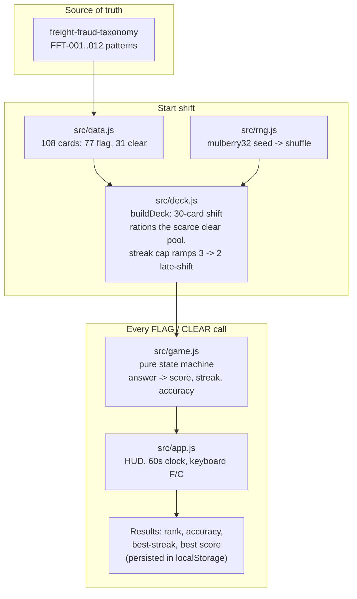

<p align="center"></p>

<div align="center">

# ONE MORE SHIFT

**A tiny farewell arcade game: flag or clear real fraud-taxonomy signals against the clock,
on your last shift.**
No invented data — every card and every reveal is copied from
[freight-fraud-taxonomy](https://github.com/Jeevan-0508/freight-fraud-taxonomy).

[](https://jeevan-0508.github.io/one-more-shift/)
[](LICENSE)
[](src/deck.test.js)
[](#whats-real)

</div>

## How it works



Every card is real. The deck-building and scoring logic are pure functions with no DOM dependency,
so the entire game loop is unit-tested (24 tests) independent of what's on screen — the DOM layer
(`src/app.js`) is the only part that isn't.

## What's real

- **108 cards**, extracted from all 12 `FFT-*.json` patterns in freight-fraud-taxonomy: 77 genuine
  risk indicators (`indicators[].signal`) and 31 genuine innocent explanations for them
  (`false_positives[].looks_like`), each with the pattern's own real `notes` / `actually` text as
  the reveal shown after you call it.
- **`src/deck.js`** — builds a 30-card shift from the 108-card pool with a hard cap on how long a
  streak of the same answer type can run. Clears are the scarcer of the two card types (31 of 108),
  so they're rationed: only spent when a streak actually needs breaking, never "for variety" — a
  version that spent them opportunistically could burn through the clear pool early and leave
  nothing to break a later flag streak. The cap itself can ramp: the last third of a shift tightens
  from 3-in-a-row to 2, so the game gets measurably harder as the clock runs down, not just longer.
  8 tests cover pool exhaustion, streak-cap enforcement, the ramp, and determinism.
- **`src/game.js`** — pure state machine (`createGame` / `answer` / `accuracy` / `rank`), no DOM.
  Correct calls score points with a streak bonus; a wrong call resets the streak to zero. 10 tests.
- **`src/rng.js`** — seeded mulberry32 PRNG + Fisher-Yates shuffle, so a deck is reproducible from
  its seed without pulling in a library. 6 tests.
- **Best score** persists in `localStorage` across shifts on this browser (`oms_best_score`), shown
  on the intro screen and called out with a "new best" badge on the results screen when it's beaten.

## Run it

Open `index.html` directly, no server needed — every script is a plain `<script>` tag, not a module
or a `fetch()` call, so this works double-clicked from disk exactly like it does on GitHub Pages.

```
bun test        # 24 tests
```

## Not yet done

- A leaderboard (would need a backend or a BYOK-style bring-your-own-storage pattern; deliberately
  left local-only, one shift at a time — the best score above is the local version of this).
